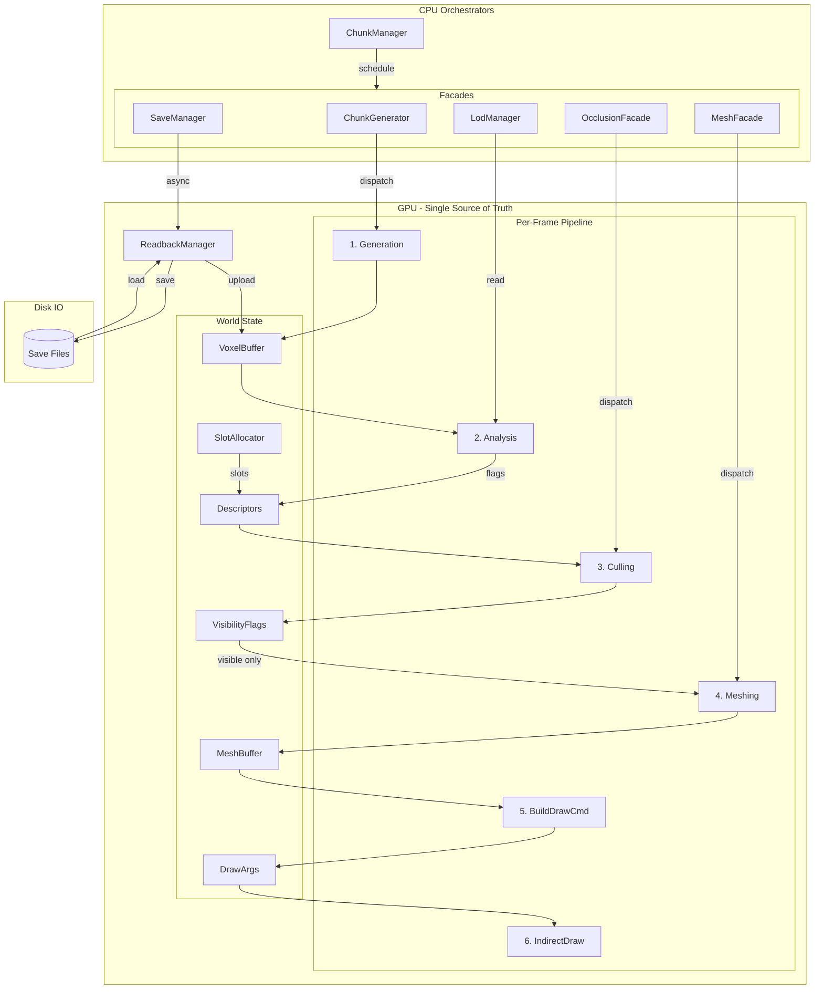
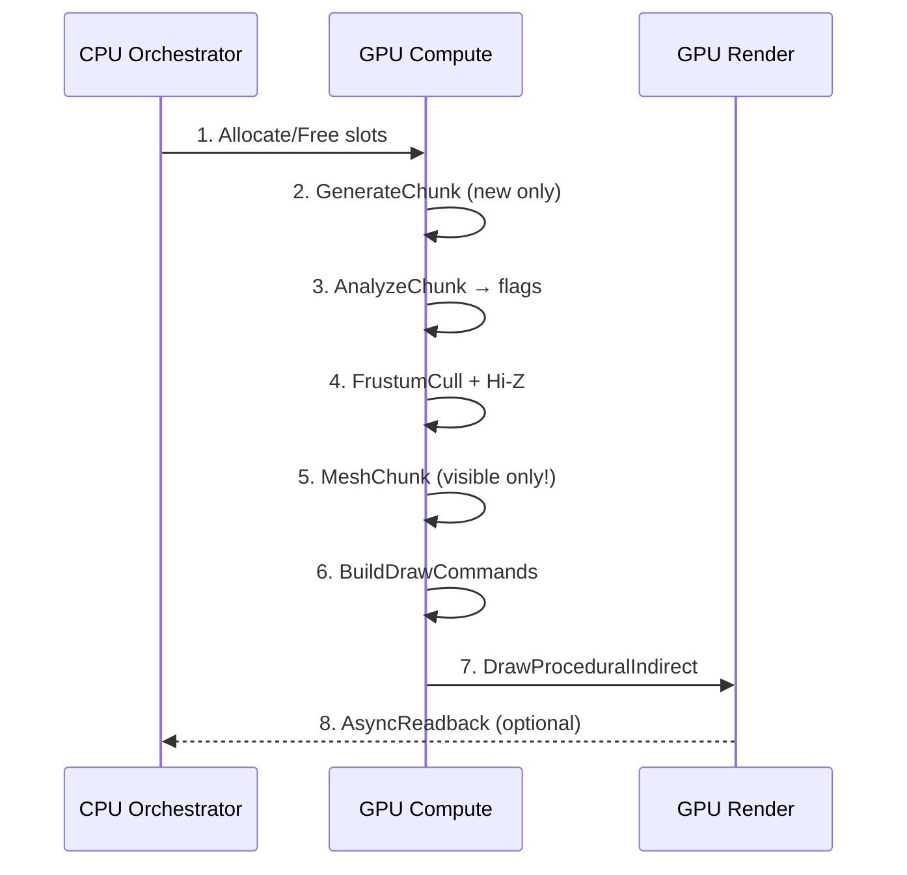

# МЕГАПЛАН: GPU-Driven Voxel Engine — Facade Mapping

---

## КРИТИЧНЕ ПРАВИЛО: GPU = Єдине джерело істини

### Архітектурна заборона

CPU файли **НЕ МАЮТЬ ПРАВА**:

- генерувати вокселі
- рахувати меш
- приймати рішення на рівні вокселя
- зберігати актуальні дані вокселів (крім Save/readback)

### Розподіл відповідальності


| Компонент | Роль                                                            |
| --------- | --------------------------------------------------------------- |
| **GPU**   | Єдине джерело істини: вокселі, меші, видимість, LOD flags       |
| **CPU**   | Оркестратор: scheduling, IO, streaming requests, gameplay logic |


### Контроль fallback

```csharp
// У КОЖНОМУ facade:
#if UNITY_EDITOR && ALLOW_CPU_FALLBACK
    if (!useGpu) return ScheduleCpuFallback(...);
#endif
    return _gpuDelegate.Schedule(...);
```

**В release build CPU fallback фізично недоступний.**

---

## Стратегія: CPU як фасади-оркестратори

CPU файли **залишаються як API**, але:

- НЕ виконують обчислення
- НЕ зберігають актуальні дані вокселів
- Тільки scheduling + IO + gameplay

---

## Маппінг файлів: CPU Facade → GPU Delegate

### Core/ (Assets/Scripts/Voxel/Core)


| Файл                                                             | Роль                | Дія           | GPU Delegate                                                                                                |
| ---------------------------------------------------------------- | ------------------- | ------------- | ----------------------------------------------------------------------------------------------------------- |
| [ChunkCoord.cs](Assets/Scripts/Voxel/Core/ChunkCoord.cs)         | Структура координат | **Без змін**  | —                                                                                                           |
| [VoxelConstants.cs](Assets/Scripts/Voxel/Core/VoxelConstants.cs) | Константи           | **Без змін**  | —                                                                                                           |
| [VoxelMath.cs](Assets/Scripts/Voxel/Core/VoxelMath.cs)           | Утиліти             | **Без змін**  | —                                                                                                           |
| [VoxelMaterial.cs](Assets/Scripts/Voxel/Core/VoxelMaterial.cs)   | Enum матеріалів     | **Без змін**  | —                                                                                                           |
| [ChunkData.cs](Assets/Scripts/Voxel/Core/ChunkData.cs)           | Буфери вокселів     | **Адаптація** | Зберігає CPU копію тільки для Save/Readback; додає `GpuOffset`/`GpuSlot` для GPU World State                |
| [Chunk.cs](Assets/Scripts/Voxel/Core/Chunk.cs)                   | MonoBehaviour чанка | **Facade**    | `ApplyMesh` → `ApplyGpuMeshRef(slot, offset)` або fallback Mesh для CPU; `MeshFilter` вимкнено при GPU mode |
| [ChunkPool.cs](Assets/Scripts/Voxel/Core/ChunkPool.cs)           | Пул Chunk-інстансів | **Facade**    | При GPU mode — пул "stub" чанків (без Mesh) або взагалі без GameObject для distant LOD                      |


---

### Generation/ (Assets/Scripts/Voxel/Generation)


| Файл                                                                       | Роль       | Дія           | GPU Delegate                                                                                                |
| -------------------------------------------------------------------------- | ---------- | ------------- | ----------------------------------------------------------------------------------------------------------- |
| [WorldGenConfig.cs](Assets/Scripts/Voxel/Generation/WorldGenConfig.cs)     | SO конфіг  | **Без змін**  | Передається в GpuChunkGenerator                                                                             |
| [NoiseStack.cs](Assets/Scripts/Voxel/Generation/NoiseStack.cs)             | SO шуму    | **Без змін**  | Upload в ComputeBuffer для VoxelGeneration.compute                                                          |
| [RockStrataConfig.cs](Assets/Scripts/Voxel/Generation/RockStrataConfig.cs) | SO шарів   | **Без змін**  | Параметри для GPU generation                                                                                |
| [IChunkGenerator.cs](Assets/Scripts/Voxel/Generation/IChunkGenerator.cs)   | Інтерфейс  | **Адаптація** | Додати `ScheduleGpuGeneration(...)` або універсальний `Schedule`                                            |
| [ChunkGenerator.cs](Assets/Scripts/Voxel/Generation/ChunkGenerator.cs)     | **Facade** | Делегує       | `GpuChunkGenerator.ScheduleGeneration(state, coord, slot)`; fallback на Burst IJobParallelFor при `!useGpu` |


---

### LOD/ (Assets/Scripts/Voxel/LOD)


| Файл                                                                | Роль               | Дія          | GPU Delegate                                                                                                                                                     |
| ------------------------------------------------------------------- | ------------------ | ------------ | ---------------------------------------------------------------------------------------------------------------------------------------------------------------- |
| [ChunkLodLevel.cs](Assets/Scripts/Voxel/LOD/ChunkLodLevel.cs)       | Struct LOD-рівня   | **Без змін** | —                                                                                                                                                                |
| [ChunkLodSettings.cs](Assets/Scripts/Voxel/LOD/ChunkLodSettings.cs) | SO LOD налаштувань | **Без змін** | —                                                                                                                                                                |
| [ChunkLodManager.cs](Assets/Scripts/Voxel/LOD/ChunkLodManager.cs)   | **Facade**         | Делегує      | `GpuChunkAnalyzer` — downsample LOD на GPU; CPU читає `ChunkDescriptor.flags` (empty/solid/mixed) для streaming; `ResolveLevel` залишається на CPU (player dist) |


---

### Meshing/ (Assets/Scripts/Voxel/Meshing)

**ВАЖЛИВО: Greedy meshing НЕ є ядром GPU meshing!**

GPU meshing стратегія по LOD:

- **Near LOD** → simple face extraction + axis merge (fast, GPU-friendly)
- **Mid LOD** → quad collapse / meshlet-like
- **Far LOD** → impostor / heightfield (не mesh взагалі)

Greedy залишається **тільки як CPU fallback** (Editor debug) або для SVO.


| Файл                                                            | Роль                       | Дія          | GPU Delegate                                                                                            |
| --------------------------------------------------------------- | -------------------------- | ------------ | ------------------------------------------------------------------------------------------------------- |
| [MeshData.cs](Assets/Scripts/Voxel/Meshing/MeshData.cs)         | NativeList вершин/індексів | **Без змін** | Тільки для CPU fallback / SVO                                                                           |
| [GreedyMesher.cs](Assets/Scripts/Voxel/Meshing/GreedyMesher.cs) | **Facade**                 | Делегує      | `GpuMesher.MeshChunk(state, chunkIndex)` — face extraction, NOT greedy; CPU fallback вимкнено в release |
| [MeshBuilder.cs](Assets/Scripts/Voxel/Meshing/MeshBuilder.cs)   | Копія MeshData → Mesh      | **Facade**   | При GPU mode — NOP (меш на GPU); при CPU/SVO — як зараз                                                 |


---

### Occlusion/ (Assets/Scripts/Voxel/Occlusion)


| Файл                                                                              | Роль       | Дія     | GPU Delegate                                                                                           |
| --------------------------------------------------------------------------------- | ---------- | ------- | ------------------------------------------------------------------------------------------------------ |
| [ChunkOcclusionCuller.cs](Assets/Scripts/Voxel/Occlusion/ChunkOcclusionCuller.cs) | **Facade** | Делегує | `GpuCuller.Cull(state, camera)` — frustum + Hi-Z occlusion; fallback на поточний raycast при `!useGpu` |


---

### Rendering/ (Assets/Scripts/Voxel/Rendering)


| Файл                                                                              | Роль                | Дія          | GPU Delegate                                                                                                |
| --------------------------------------------------------------------------------- | ------------------- | ------------ | ----------------------------------------------------------------------------------------------------------- |
| [VoxelMaterialLibrary.cs](Assets/Scripts/Voxel/Rendering/VoxelMaterialLibrary.cs) | SO Texture2DArray   | **Без змін** | —                                                                                                           |
| [SrpBatchingConfig.cs](Assets/Scripts/Voxel/Rendering/SrpBatchingConfig.cs)       | Конфіг SRP batching | **Без змін** | —                                                                                                           |
| [VoxelMaterialBinder.cs](Assets/Scripts/Voxel/Rendering/VoxelMaterialBinder.cs)   | **Facade**          | Делегує      | При GPU instancing — `Material.SetBuffer("_InstanceMatrices", ...)` замість per-Renderer; fallback як зараз |


---

### Save/ (Assets/Scripts/Voxel/Save)


| Файл                                                                             | Роль         | Дія           | GPU Delegate                                                                                                                |
| -------------------------------------------------------------------------------- | ------------ | ------------- | --------------------------------------------------------------------------------------------------------------------------- |
| [ChunkSaveBinary.cs](Assets/Scripts/Voxel/Save/ChunkSaveBinary.cs)               | Серіалізація | **Без змін**  | —                                                                                                                           |
| [ChunkModBinary.cs](Assets/Scripts/Voxel/Save/ChunkModBinary.cs)                 | Дельти       | **Без змін**  | —                                                                                                                           |
| [RleCompression.cs](Assets/Scripts/Voxel/Save/RleCompression.cs)                 | RLE          | **Без змін**  | —                                                                                                                           |
| [Lz4Codec.cs](Assets/Scripts/Voxel/Save/Lz4Codec.cs)                             | LZ4          | **Без змін**  | —                                                                                                                           |
| [Crc32.cs](Assets/Scripts/Voxel/Save/Crc32.cs)                                   | CRC          | **Без змін**  | —                                                                                                                           |
| [ChunkSaveMode.cs](Assets/Scripts/Voxel/Save/ChunkSaveMode.cs)                   | Enum режимів | **Без змін**  | —                                                                                                                           |
| [ChunkSaveManager.cs](Assets/Scripts/Voxel/Save/ChunkSaveManager.cs)             | **Facade**   | Делегує       | `GpuReadbackManager.RequestChunkData(coord, callback)` → readback з GPU → `ChunkSaveBinary.Serialize`; load → upload на GPU |
| [ChunkModManager.cs](Assets/Scripts/Voxel/Save/ChunkModManager.cs)               | **Facade**   | Делегує       | Аналогічно: readback для save, upload для load                                                                              |
| [ChunkHybridSaveManager.cs](Assets/Scripts/Voxel/Save/ChunkHybridSaveManager.cs) | **Facade**   | Orchestration | `TryLoadSnapshot`/`ApplyDeltaIfAny` через GPU upload; `HandleChunkUnloaded` через readback                                  |
| [VoxelModDebugInput.cs](Assets/Scripts/Voxel/Save/VoxelModDebugInput.cs)         | Debug input  | **Facade**    | Запис модифікацій в GPU buffer через compute                                                                                |


---

### Streaming/ (Assets/Scripts/Voxel/Streaming)


| Файл                                                                                          | Роль                | Дія           | GPU Delegate                                                                                                                                                                            |
| --------------------------------------------------------------------------------------------- | ------------------- | ------------- | --------------------------------------------------------------------------------------------------------------------------------------------------------------------------------------- |
| [ChunkManager.cs](Assets/Scripts/Voxel/Streaming/ChunkManager.cs)                             | **Головний Facade** | Делегує       | `GpuWorldState`; `_loader` → allocate slot на GPU; `_jobs` → `GpuChunkGenerator`/`GpuMesher`; `_integration` → GPU mesh ref; `_culler` → `GpuCuller`; `_renderer` → `GpuDrivenRenderer` |
| [ChunkManager.Context.cs](Assets/Scripts/Voxel/Streaming/ChunkManager.Context.cs)             | Partial Context     | **Адаптація** | Додати `GpuWorldState`, `GpuChunkGenerator`, `GpuMesher`, `GpuCuller`                                                                                                                   |
| [ChunkManager.Jobs.cs](Assets/Scripts/Voxel/Streaming/ChunkManager.Jobs.cs)                   | Partial Jobs        | **Facade**    | `ScheduleGenJob` → `_gpuGenerator.ScheduleGeneration`; `ScheduleMeshForChunk` → `_gpuMesher.MeshChunk`; fallback на CPU Jobs                                                            |
| [ChunkManager.Cache.cs](Assets/Scripts/Voxel/Streaming/ChunkManager.Cache.cs)                 | Partial Cache       | **Facade**    | GPU World State = primary cache; CPU cache тільки для evicted chunks (Save/readback)                                                                                                    |
| [ChunkManager.Lifecycle.cs](Assets/Scripts/Voxel/Streaming/ChunkManager.Lifecycle.cs)         | Partial Lifecycle   | **Адаптація** | `ProcessPending` → allocate slot на GPU, dispatch generation                                                                                                                            |
| [ChunkManager.Pending.cs](Assets/Scripts/Voxel/Streaming/ChunkManager.Pending.cs)             | Partial Pending     | **Без змін**  | Pending queue залишається на CPU                                                                                                                                                        |
| [ChunkManager.Removal.cs](Assets/Scripts/Voxel/Streaming/ChunkManager.Removal.cs)             | Partial Removal     | **Facade**    | `RemoveChunk` → `GpuWorldState.FreeChunk(slot)`; readback для save перед free                                                                                                           |
| [ChunkManager.Spawn.cs](Assets/Scripts/Voxel/Streaming/ChunkManager.Spawn.cs)                 | Partial Spawn       | **Facade**    | `SpawnChunk` при GPU → allocate slot, dispatch gen, без GameObject для far LOD                                                                                                          |
| [ChunkManager.Neighbors.cs](Assets/Scripts/Voxel/Streaming/ChunkManager.Neighbors.cs)         | Partial Neighbors   | **Адаптація** | Neighbor data для GPU meshing (offset в VoxelMaterialBuffer)                                                                                                                            |
| [ChunkLoader.cs](Assets/Scripts/Voxel/Streaming/ChunkLoader.cs)                               | **Facade**          | Делегує       | `MaintainRadius` → GPU allocate/deallocate slots                                                                                                                                        |
| [ChunkJobsManager.cs](Assets/Scripts/Voxel/Streaming/ChunkJobsManager.cs)                     | **Facade**          | Делегує       | `ProcessGenJobs`/`ProcessMeshJobs` → dispatch GPU compute                                                                                                                               |
| [ChunkIntegrationManager.cs](Assets/Scripts/Voxel/Streaming/ChunkIntegrationManager.cs)       | **Facade**          | Делегує       | При GPU — "integration" = оновлення ChunkDescriptor; без ApplyMesh (меш на GPU)                                                                                                         |
| [ChunkCacheManager.cs](Assets/Scripts/Voxel/Streaming/ChunkCacheManager.cs)                   | **Facade**          | Делегує       | GPU World State = mesh cache; CPU data cache для Save/eviction                                                                                                                          |
| [ChunkAdaptiveLimitsManager.cs](Assets/Scripts/Voxel/Streaming/ChunkAdaptiveLimitsManager.cs) | **Facade**          | Адаптація     | Ліміти для GPU dispatch (max gen/mesh per frame)                                                                                                                                        |
| [ChunkWorkDropManager.cs](Assets/Scripts/Voxel/Streaming/ChunkWorkDropManager.cs)             | Work drop           | **Без змін**  | —                                                                                                                                                                                       |
| [ChunkSafeSpawnManager.cs](Assets/Scripts/Voxel/Streaming/ChunkSafeSpawnManager.cs)           | Safe spawn          | **Без змін**  | —                                                                                                                                                                                       |
| [ChunkPhysicsManager.cs](Assets/Scripts/Voxel/Streaming/ChunkPhysicsManager.cs)               | **Facade**          | Опційно       | GPU heightfield колайдери або CPU fallback                                                                                                                                              |
| [ChunkPhysicsOptimizer.cs](Assets/Scripts/Voxel/Streaming/ChunkPhysicsOptimizer.cs)           | Physics opt         | **Без змін**  | —                                                                                                                                                                                       |
| [ChunkViewConePrioritizer.cs](Assets/Scripts/Voxel/Streaming/ChunkViewConePrioritizer.cs)     | View cone           | **Без змін**  | CPU пріоритизація pending                                                                                                                                                               |
| [ChunkJobHandles.cs](Assets/Scripts/Voxel/Streaming/ChunkJobHandles.cs)                       | Job handles         | **Адаптація** | При GPU — ComputeBuffer handles, AsyncGPUReadback                                                                                                                                       |
| [StreamingTimeBudget.cs](Assets/Scripts/Voxel/Streaming/StreamingTimeBudget.cs)               | Бюджет часу         | **Без змін**  | —                                                                                                                                                                                       |
| [ChunkTask.cs](Assets/Scripts/Voxel/Streaming/ChunkTask.cs)                                   | Task enum           | **Без змін**  | —                                                                                                                                                                                       |
| [PlayerTracker.cs](Assets/Scripts/Voxel/Streaming/PlayerTracker.cs)                           | World→Chunk         | **Без змін**  | —                                                                                                                                                                                       |


---

### SVO/ (Assets/Scripts/Voxel/Svo)

**ПОПЕРЕДЖЕННЯ: GPU-SVO — research-level складність!**

- 80% виграшу отримується **БЕЗ SVO** (через GPU meshing + culling)
- GPU-SVO потребує окремого R&D
- **Відкладається ПІСЛЯ повного GPU-rendering pipeline (Phase 9+)**
- До того часу SVO працює на CPU як зараз (для Editor/debug LOD)


| Файл                                                            | Роль          | Дія          | GPU Delegate                                                               |
| --------------------------------------------------------------- | ------------- | ------------ | -------------------------------------------------------------------------- |
| [SvoVolume.cs](Assets/Scripts/Voxel/Svo/SvoVolume.cs)           | Структура SVO | **Без змін** | CPU-only до Phase 9+                                                       |
| [SvoBuilder.cs](Assets/Scripts/Voxel/Svo/SvoBuilder.cs)         | CPU SVO build | **Без змін** | CPU-only до Phase 9+ (research: GpuSvoBuilder)                             |
| [SvoMeshBuilder.cs](Assets/Scripts/Voxel/Svo/SvoMeshBuilder.cs) | CPU SVO mesh  | **Без змін** | CPU-only до Phase 9+                                                       |
| [SvoManager.cs](Assets/Scripts/Voxel/Svo/SvoManager.cs)         | SVO кеш       | **Без змін** | Залишається CPU для Editor debug LOD; GPU-SVO Phase 9+ (optional research) |


---

## Нові GPU файли (Assets/Scripts/Voxel/GPU/)


| Файл                   | Призначення                                     |
| ---------------------- | ----------------------------------------------- |
| GpuWorldState.cs       | Буфери, ChunkDescriptor, SlotAllocator          |
| GpuSlotAllocator.cs    | Fixed slots, free-list, generation id           |
| GpuChunkDescriptor.cs  | Struct (HLSL-aligned, 32 bytes)                 |
| GpuChunkGenerator.cs   | Dispatch VoxelGeneration.compute                |
| GpuChunkAnalyzer.cs    | Dispatch ChunkAnalysis.compute                  |
| GpuMesher.cs           | Dispatch VoxelMeshing.compute (face extraction) |
| GpuCuller.cs           | Dispatch ChunkCulling.compute, Hi-Z generation  |
| GpuReadbackManager.cs  | AsyncGPUReadback для Save/debug                 |
| GpuDrivenRenderer.cs   | DrawProceduralIndirect                          |
| GpuErosionSimulator.cs | (Phase 8, optional) Erosion.compute             |


---

## GPU World State Lifetime Management

**КРИТИЧНО для коректності!**

### GpuSlotAllocator

```csharp
public class GpuSlotAllocator {
    int _maxSlots;
    Stack<int> _freeList;           // free slot indices
    uint[] _generationIds;          // per-slot generation (increments on free)
    
    public (int slot, uint generation) Allocate();
    public void Free(int slot);     // increments generation
    public bool IsValid(int slot, uint generation); // use-after-free check
}
```

### ChunkDescriptor з versioning

```hlsl
struct ChunkDescriptor {
    int3 coord;
    uint slotGeneration;    // КРИТИЧНО: перевірка use-after-free
    uint voxelOffset;
    uint meshOffset;
    uint vertexCount;
    uint flags;             // empty/solid/mixed/visible/dirty
};
```

### Правила lifetime

1. **Allocate:** `slot, gen = allocator.Allocate()` → upload descriptor
2. **Use:** завжди перевіряти `generation == descriptor.slotGeneration`
3. **Free:** `allocator.Free(slot)` → increments generation → slot reusable
4. **GPU check:** в compute shaders перевіряти generation перед доступом

---

## Нові Compute Shaders (Assets/Shaders/Compute/)


| Файл                    | Kernels                                                      |
| ----------------------- | ------------------------------------------------------------ |
| VoxelGeneration.compute | GenerateChunk                                                |
| ChunkAnalysis.compute   | AnalyzeChunk, DownsampleLOD                                  |
| VoxelMeshing.compute    | DetectFaces, PrefixSum, GenerateVertices                     |
| ChunkCulling.compute    | FrustumCull, OcclusionCull, BuildDrawCommands, GenerateHiZ   |
| Erosion.compute         | (опційно) SimulateWaterFlow, SimulateSediment, CommitChanges |
| SvoBuild.compute        | (опційно) BuildSvoNodes                                      |


---

## Приклад Facade (ChunkGenerator)

```csharp
// ChunkGenerator.cs — Facade
public class ChunkGenerator : IChunkGenerator
{
    [SerializeField] bool useGpu = true;
    GpuChunkGenerator _gpuGenerator;
    WorldGenConfig _config;
    NoiseStack _noiseStack;

    public JobHandle Schedule(ChunkCoord coord, ChunkData data, ...)
    {
        if (useGpu && _gpuGenerator != null)
        {
            _gpuGenerator.ScheduleGeneration(_worldState, coord, slot);
            return default; // GPU async
        }
        return ScheduleCpuBurst(coord, data, ...); // fallback
    }
}
```

---

## Оновлена діаграма архітектури




---

## Діаграма Per-Frame Pipeline




---

## Порядок впровадження (фази) — ОНОВЛЕНИЙ

**Ключова зміна: Culling ПЕРЕД Meshing!**
Не генеруємо меші, які ніхто не побачить.

### Phase 0: Foundation

- `GpuWorldState.cs` — буфери, descriptor pool
- `GpuSlotAllocator.cs` — fixed slots, free-list, generation id
- `GpuChunkDescriptor.cs` — HLSL-aligned struct

### Phase 1: GPU Generation

- `VoxelGeneration.compute` — noise, heightmap, materials
- `GpuChunkGenerator.cs` — dispatch, parameter upload
- `ChunkGenerator.cs` — Facade (CPU fallback #if EDITOR)

### Phase 2: GPU Analysis

- `ChunkAnalysis.compute` — empty/solid/mixed flags, LOD downsample
- `GpuChunkAnalyzer.cs` — dispatch, flag readback (async)
- `ChunkLodManager.cs` — читає flags для streaming decisions

### Phase 3: GPU Culling (ПЕРЕД meshing!)

- `ChunkCulling.compute` — frustum cull, Hi-Z occlusion
- `GpuCuller.cs` — dispatch, Hi-Z generation
- `ChunkOcclusionCuller.cs` — Facade (CPU raycast #if EDITOR)
- **Результат:** `VisibilityFlags` buffer

### Phase 4: GPU Meshing (тільки visible!)

- `VoxelMeshing.compute` — face extraction + axis merge (NOT greedy!)
- `GpuMesher.cs` — dispatch тільки для `VisibilityFlags[i] == 1`
- `GreedyMesher.cs` — Facade (CPU greedy #if EDITOR)
- **Near LOD:** face extraction + merge
- **Mid LOD:** quad collapse
- **Far LOD:** skip mesh, use impostor/heightfield

### Phase 5: GPU-Driven Rendering

- `VoxelTriplanarURP_Instanced.shader` — procedural instancing
- `GpuDrivenRenderer.cs` — `DrawProceduralIndirect`
- `BuildDrawCommands` kernel — формує draw args на GPU

### Phase 6: Async Readback + Save

- `GpuReadbackManager.cs` — visible count, chunk data для save
- `ChunkSaveManager.cs`, `ChunkModManager.cs` — Facade (readback → serialize)
- `ChunkHybridSaveManager.cs` — orchestration

### Phase 7: Full Integration

- `ChunkManager.Context.cs` — inject GPU components
- `ChunkManager.Jobs.cs` — dispatch замість Schedule
- `ChunkManager.Cache.cs` — GPU World State = primary
- **КРИТИЧНО:** вимкнути CPU fallback в release build

### Phase 8: Erosion (optional)

- `Erosion.compute` — water flow, sediment, delta accumulation
- `GpuErosionSimulator.cs` — tick, commit changes
- Тільки після Phase 7 стабільний

### Phase 9: SVO GPU (optional, research)

- GPU-SVO = окремий research project
- НЕ блокує основний pipeline
- Відкладено до post-MVP

---

## Пайплайн на кадр (після Phase 7)

```
CPU: UpdateStreamingRequests() → allocate/free GPU slots
     ↓
GPU: GenerateChunk (new slots only)
     ↓
GPU: AnalyzeChunk → flags (empty/solid/mixed)
     ↓
GPU: FrustumCull + OcclusionCull → VisibilityFlags
     ↓
GPU: MeshChunk (тільки visible && !meshed)
     ↓
GPU: BuildDrawCommands → DrawArgs
     ↓
GPU: DrawProceduralIndirect (ONE call for all chunks!)
     ↓
CPU: AsyncReadback (save requests, debug stats)
```

---

## РИЗИКИ ТА ОБМЕЖЕННЯ

### Технічні ризики


| Ризик                        | Мітигація                                                             |
| ---------------------------- | --------------------------------------------------------------------- |
| **VRAM overflow**            | Ring buffer / LRU eviction в GpuSlotAllocator                         |
| **Use-after-free**           | Generation ID в кожному descriptor                                    |
| **CPU fallback залишається** | `#if UNITY_EDITOR && ALLOW_CPU_FALLBACK` — фізично вимкнено в release |
| **Greedy на GPU**            | НЕ робимо — face extraction + axis merge                              |
| **SVO complexity**           | Відкладено до Phase 9+ (post-MVP)                                     |
| **Debug складність**         | RenderDoc, GPU profiler, async readback для stats                     |


### Сумісність

- **Мінімум:** DX11, Vulkan, Metal (Compute Shader 5.0)
- **Unity:** 2021.3+ (AsyncGPUReadback, ComputeBuffer)
- **Shadows:** `DrawProceduralIndirect` з `ShadowCastingMode.On` (може потребувати workaround)

### Що НЕ входить в цей план

- Вода (окремий render pass)
- Біоми/strata (параметри для generation, не архітектура)
- Multiplayer sync
- Editor tools (chunk inspector, noise preview)

---

## ПРАВИЛА ДИСЦИПЛІНИ

1. **GPU = єдине джерело істини** — CPU не зберігає актуальні вокселі
2. **CPU fallback = #if EDITOR** — фізично недоступний в release
3. **Greedy НЕ на GPU** — face extraction + merge
4. **SVO = Phase 9+** — не блокує основний pipeline
5. **Slot generation ID** — завжди перевіряти перед доступом
6. **Culling ПЕРЕД meshing** — не генеруємо невидимі меші
7. **Один indirect draw** — мета: 1 draw call на всі чанки

---

## МЕТРИКИ УСПІХУ


| Метрика                      | Поточна   | Ціль                                                 |
| ---------------------------- | --------- | ---------------------------------------------------- |
| Draw calls (1000 chunks)     | ~1000     | 1-10                                                 |
| CPU frame time (gen+mesh)    | ~8ms      | <1ms                                                 |
| GPU frame time               | ~2ms      | ~4ms (більше роботи на GPU, але загальний FPS вищий) |
| View distance (stable 60fps) | ~5 chunks | ~20+ chunks                                          |
| Memory (CPU NativeArray)     | ~500MB    | ~50MB (тільки Save/cache)                            |


