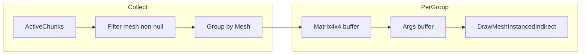

# План: 35. Indirect Draw Calls (ROADMAP)

## Контекст

- Зараз кожен чанк — окремий GameObject з [MeshFilter](Assets/Scripts/Voxel/Core/Chunk.cs) + MeshRenderer; один draw call на видимий чанк (або батч через SRP Batcher при спільному матеріалі).
- Є [mesh cache](Assets/Scripts/Voxel/Streaming/ChunkCacheManager.cs): чанки можуть ділити один і той самий Mesh (ApplySharedMesh) за hash; [ChunkSaveBinary](Assets/Scripts/Voxel/Save/ChunkSaveBinary.cs) і подальша інтеграція не змінюються.
- [VoxelTriplanarURP.shader](Assets/Shaders/VoxelTriplanarURP.shader) не використовує GPU instancing (немає `#pragma multi_compile_instancing`, UNITY_INSTANCING_BUFFER).
- Indirect draw: один виклик на «групу» інстансів з аргументами (vertex count, instance count тощо) і буфером даних інстансів (матриці) — дозволяє зменшити кількість draw calls, коли багато чанків мають однаковий меш.

## Ціль

Додати **опційний** режим рендеру через `Graphics.DrawMeshInstancedIndirect`: для видимих чанків з однаковим мешем виконувати один indirect draw замість окремого draw на чанк; при включеному режимі не використовувати MeshRenderer тих чанків, які малюються цим шляхом.

## 1. Компонент / система рендеру (новий файл)

**Розташування:** [Assets/Scripts/Voxel/Rendering/ChunkIndirectRenderer.cs](Assets/Scripts/Voxel/Rendering/ChunkIndirectRenderer.cs) (або аналогічна назва).

**Призначення:**

- Опційно прив’язаний до ChunkManager (або окремий компонент на сцені); прапорець `enableIndirectDraw`.
- Кожен кадр (наприклад, у `LateUpdate` або через callback після culling): зібрати видимі чанки з `ChunkManager.ActiveChunks`, згрупувати їх по **мешу** (reference або mesh cache hash — однаковий Mesh → одна група).
- Для кожної групи (унікальний Mesh): зібрати список `Matrix4x4` (world matrix чанка = transform.localToWorldMatrix); виділити або перевикористати `ComputeBuffer` з матрицями (наприклад, `stride = 64` для Matrix4x4); заповнити args buffer (layout для DrawMeshInstancedIndirect: vertexCountPerInstance, instanceCount, startVertex, startInstance, 0); викликати `Graphics.DrawMeshInstancedIndirect(mesh, submeshIndex, material, bounds, argsBuffer, argsOffset, properties)` з MaterialPropertyBlock, що вказує buffer матриць на ім’я, очікуване шейдером (наприклад `_InstanceMatrices` або `unity_InstanceID` + built-in instancing).
- Для чанків, що потрапили в якусь групу: тимчасово вимкнути `chunk.SetRendererEnabled(false)` на цей кадр (або тримати список «drawn by indirect» і не вмикати їм renderer, поки режим увімкнено).
- Обмеження: максимальна кількість інстансів на один draw (наприклад 1023 через обмеження Unity); при перевищенні — кілька indirect draws для того ж мешу або fallback на звичайний рендер.

**Деталі:**

- Доступ до видимих чанків: через `ChunkManager.ActiveChunks`; враховувати occlusion (ChunkOcclusionCuller вимикає renderer — при indirect режимі або передавати список «visible» окремо, або використовувати ті самі чанки, у яких renderer.enabled, але тоді подвійне малювання; краще: при `enableIndirectDraw` occlusion culler не вимикає renderer, а ми самі не малюємо через renderer, а тільки через indirect; тобто список «visible» має узгоджуватися з тим, кого ми малюємо indirect — тільки ті, хто в frustum і не occluded). Найпростіший варіант: брати всі активні чанки з непорожнім мешем і групувати по мешу; occlusion залишається на рівні «вимикаємо renderer» — тоді для indirect треба або не вимикати renderer тим чанкам, а виключати їх із списку інстансів (потрібен доступ до «occluded» set або окремий список visible). Щоб не ускладнювати: на першому етапі можна малювати indirect **усі** активні чанки з спільним мешем і не інтегрувати occlusion в цей компонент (occlusion продовжує вимикати renderer — тоді ми малюємо indirect тільки «не occluded» якщо ми взагалі не вимикаємо renderer при indirect, а даємо occlusion culler вимикати; але тоді ми малюємо через indirect і renderer вимкнений, тож окклюдіровані чанки не повинні потрапляти в список інстансів). Отже: компонент отримує список «chunks to draw» — або всі активні (без occlusion), або інтеграція з occlusion: передавати тільки ті, у кого renderer.enabled після culling (тоді перед indirect draw треба вимкнути їм renderer і додати в список інстансів). Рекомендація: компонент збирає чанки з `ActiveChunks`, фільтрує по `GetRenderMesh() != null && vertexCount > 0`; для indirect режиму викликати його після occlusion culler і брати тільки чанки з `renderer.enabled == true`, потім вимкнути їм renderer і намалювати їх indirect. Так уникнемо подвійного малювання.
- Bounds: combined bounds усіх інстансів групи для frustum culling (або один великий bounds).
- Буфери: перевикористовувати ComputeBuffer з потрібним stride/count; оновлювати кожен кадр; Dispose при вимкненні.

## 2. Шейдер: підтримка instancing

**Файл:** [Assets/Shaders/VoxelTriplanarURP.shader](Assets/Shaders/VoxelTriplanarURP.shader).

- Додати варіант з GPU instancing: `#pragma multi_compile_instancing` і в блоці CBUFFER або через `UNITY_INSTANCING_BUFFER` — per-instance `unity_ObjectToWorld` (або власний buffer з матрицями, якщо використовуємо MaterialPropertyBlock + ComputeBuffer).
- Unity DrawMeshInstancedIndirect з MaterialPropertyBlock з `SetBuffer("_InstanceMatrices", buffer)` вимагає, щоб шейдер читав матриці з цього буфера по `unity_InstanceID`. Тобто в vertex shader: `float4 worldPos = mul(_InstanceMatrices[unity_InstanceID], positionOS)` замість `TransformObjectToWorld`. Потрібен варіант або підмножина шейдера для indirect (окремий Pass або keyword), щоб не ламати поточний SRP Batcher path (без instancing).
- Альтернатива: використовувати вбудований Unity instancing (`DrawMeshInstanced` з масивом матриць і матеріалом з `enableInstancing = true`) — тоді шейдер лише додає `#pragma multi_compile_instancing` і `UNITY_INSTANCING_BUFFER` з `unity_ObjectToWorld`; це не «indirect», але зменшує draw calls. План орієнтується на **DrawMeshInstancedIndirect** для можливості подальшого GPU culling (args від compute).

## 3. Інтеграція з ChunkManager та occlusion

- ChunkManager (або окремий налаштовуваний посилання) дає доступ до ActiveChunks; ChunkIndirectRenderer підписується на оновлення або кожен кадр читає ActiveChunks.
- Узгодження з [ChunkOcclusionCuller](Assets/Scripts/Voxel/Occlusion/ChunkOcclusionCuller.cs): при включеному indirect draw варіанти: (A) occlusion продовжує вимикати renderer — тоді перед збором інстансів брати тільки чанки з `renderer.enabled` і не вимикати їм renderer до кінця кадру, а малювати їх indirect і не вмикати renderer назад (тобто «drawn by indirect» чанки взагалі не керуються occlusion по renderer); (B) occlusion culler передає список visible coords — indirect renderer фільтрує по ньому. Найпростіше: indirect renderer збирає чанки з ActiveChunks, у яких `GetRenderMesh() != null` і (опційно) `renderer.enabled`; якщо режим «indirect only» для цих чанків, то occlusion може виставляти «visible» флаг у доп. структурі, а ми не використовуємо renderer — тоді потрібна зміна в occlusion culler, щоб він не вимикав renderer для чанків у «indirect» списку, а вимикав їх із набору для малювання. Мінімальна зміна: не чіпати occlusion; indirect renderer малює всі активні чанки з непорожнім мешем, але **вимикає їм renderer** перед малюванням і вмикає після — тоді якщо occlusion вже вимкнув частину, ми малюємо indirect тільки тих, у кого renderer ще enabled (ми їх вимикаємо, додаємо в список, малюємо, вмикаємо назад). Так узгодження зберігається.

## 4. Матеріал і SRP Batcher

- DrawMeshInstancedIndirect з MaterialPropertyBlock **не** батчиться з SRP Batcher для цих викликів; це прийнятна ціна за один draw на групу мешів. Альтернатива — окремий материал тільки для indirect з тим самим шейдером; в документації зазначити взаємодію.

## 5. Порядок внесення змін

1. **Шейдер:** додати в [VoxelTriplanarURP.shader](Assets/Shaders/VoxelTriplanarURP.shader) підтримку instancing (варіант з buffer матриць по `unity_InstanceID` або Unity instancing) і, за потреби, окремий keyword для indirect path.
2. **ChunkIndirectRenderer:** створити компонент; збір видимих чанків (ActiveChunks + умова mesh/renderer); групування по Mesh; заповнення ComputeBuffer (Matrix4x4[]) і args buffer; виклик DrawMeshInstancedIndirect; вимкнення/вмикання renderer для намальованих чанків; обмеження по max instances per draw; Dispose буферів.
3. **Інтеграція:** опційне посилання на ChunkManager; виклик після occlusion (наприклад порядок у Update/LateUpdate); опція enableIndirectDraw у інспекторі.
4. **Документація:** ROADMAP — відзначити «35. Indirect Draw Calls»; FILEMAP — додати ChunkIndirectRenderer і зміни шейдера.

## 6. Ризики та обмеження

- Багато унікальних мешів (мало повторів) — мало виграшу від групування; можливий fallback: якщо для мешу лише один інстанс, малювати через звичайний renderer.
- Обмеження Unity на кількість інстансів за один виклик (1023) — розбивати на кілька draws.
- Зворотна сумісність: без увімкнення опції поведінка лишається як зараз (один draw на чанк / SRP batching).

## Діаграма потоку (indirect path)

