# FILEMAP

Оновлено: 2026-01-23

## Діаграма взаємодій у проекті (повна)

Нижче — як взаємодіють усі частини проекту: гравець/камера, стрімінг, CPU-фасади, GPU-пайплайн, буфери, compute-шейдери, рендер і збереження.

```mermaid
flowchart TB
    subgraph Input ["Вхід: гравець і камера"]
        PT[PlayerTracker]
        CAM[Camera]
    end

    subgraph CPU ["CPU — оркестратори та фасади"]
        CM[ChunkManager]
        subgraph Partials [ChunkManager partials]
            Loader[ChunkLoader\nMaintainRadius]
            Pending[ChunkManager.Pending\npending/preload]
            Lifecycle[ChunkManager.Lifecycle\nProcessPending/Preload]
            Spawn[ChunkManager.Spawn\nSpawnChunk / SpawnChunkGpu]
            Removal[ChunkManager.Removal\nRemoveChunk, FreeChunk]
            Jobs[ChunkManager.Jobs\nScheduleGen/Mesh → GPU dispatch]
            Cache[ChunkManager.Cache\nGPU World State = primary]
            Neighbors[ChunkManager.Neighbors\nRemesh, сусіди]
        end
        subgraph Facades [Facades]
            CG[ChunkGenerator]
            GM[GreedyMesher]
            OC[ChunkOcclusionCuller]
            CL[ChunkLodManager]
            CSM[ChunkSaveManager]
            CMM[ChunkModManager]
            CHSM[ChunkHybridSaveManager]
            VMB[VoxelMaterialBinder]
        end
    end

    subgraph GPU ["GPU — єдине джерело істини"]
        GWS[GpuWorldState]
        ALLOC[GpuSlotAllocator\nallocate / free, generation id]
        VB[(VoxelBuffer)]
        MB[(MeshBuffer)]
        CD[(ChunkDescriptors\n+ ExpectedGeneration)]
        VF[(VisibilityFlags)]
        DA[(DrawArgs)]

        subgraph Pipeline [Per-frame pipeline]
            GEN[GpuChunkGenerator\nVoxelGeneration.compute]
            ANAL[GpuChunkAnalyzer\nChunkAnalysis.compute]
            CULL[GpuCuller\nChunkCulling.compute]
            MESH[GpuMesher\nVoxelMeshing.compute]
            BUILD[BuildDrawCommands]
            DRAW[GpuDrivenRenderer\nDrawProceduralIndirect]
        end

        RB[GpuReadbackManager\nAsyncGPUReadback]
    end

    subgraph Compute [Compute Shaders]
        VG[VoxelGeneration.compute\nGenerateChunk]
        CA[ChunkAnalysis.compute\nClearCounts, AnalyzeChunkCount,\nAnalyzeChunkFlags, DownsampleLOD]
        CC[ChunkCulling.compute\nFrustumCull, OcclusionCull,\nBuildDrawCommands]
        VM[VoxelMeshing.compute\nDetectFaces, PrefixSum,\nGenerateVertices]
        ER[Erosion.compute\noptional]
    end

    subgraph IO [Диск і Save/Load]
        DISK[(Save Files\nsnapshot / delta)]
        SaveBin[ChunkSaveBinary\nChunkModBinary]
    end

    PT --> CM
    CAM --> OC
    CM --> Partials
    CM --> Facades

    Loader --> Spawn
    Pending --> Lifecycle
    Lifecycle --> Spawn
    Spawn --> GWS
    Spawn --> CSM
    Spawn --> CMM
    Spawn --> CHSM
    Removal --> GWS
    Removal --> RB
    Removal --> CHSM
    Jobs --> CG
    Jobs --> MESH
    Cache --> GWS

    CG --> GEN
    GM --> MESH
    OC --> CULL
    CL --> ANAL

    GWS --> ALLOC
    GWS --> VB
    GWS --> MB
    GWS --> CD

    GEN --> VG
    VG --> VB
    ANAL --> CA
    CA --> CD
    CULL --> CC
    CC --> VF
    CC --> DA
    MESH --> VM
    VM --> MB
    BUILD --> DA
    DRAW --> DA
    DRAW --> MB

    CSM --> RB
    CMM --> RB
    CHSM --> RB
    CHSM --> CSM
    CHSM --> CMM
    RB --> VB
    RB --> SaveBin
    SaveBin --> DISK
    DISK --> SaveBin
    SaveBin --> RB
    RB --> VB

    VMB --> DRAW
```

**Послідовність на кадр (GPU pipeline):**

1. **CPU:** `ChunkManager.Update` → MaintainRadius, ProcessPending/Preload → allocate/free слотів (GpuWorldState), SpawnChunkGpu (load from cache/snapshot → upload або schedule GPU generation).
2. **GPU:** GenerateChunk (нові чанки) → AnalyzeChunk (ClearCounts → AnalyzeChunkCount → AnalyzeChunkFlags) → FrustumCull + OcclusionCull → MeshChunk (тільки visible) → BuildDrawCommands → DrawProceduralIndirect.
3. **CPU (опційно):** GpuReadbackManager — AsyncGPUReadback для save; ChunkSaveManager/ChunkModManager/ChunkHybridSaveManager серіалізують і пишуть на диск; при load — завантаження в буфер і upload у VoxelBuffer через GpuWorldState.

**Правило:** GPU = єдине джерело істини для вокселів, мешів і видимості; CPU лише оркеструє (scheduling, IO, gameplay). CPU fallback доступний тільки під `#if UNITY_EDITOR && ALLOW_CPU_FALLBACK`.

---

## Структура voxel-підсистеми (Assets/Scripts/Voxel)

**Легенда:** **Facade** — CPU делегує GPU; **Адаптація** — зміни під GPU; **Без змін** — як раніше.

- Core/
  - `VoxelConstants.cs` — константи масштабу (ChunkSize=32, ColumnChunks=8, VoxelSize=0.1m). **Без змін.**
  - `VoxelMath.cs` — clamp‑утиліти для безпечних конвертацій координат. **Без змін.**
  - `ChunkCoord.cs` — координата чанка (X,Y,Z), легкий GetHashCode/Equals/ToString. **Без змін.**
  - `VoxelMaterial.cs` — ushort enum (Air, Dirt, Stone, Sand, Water). **Без змін.**
  - `ChunkData.cs` — буфери NativeArray<ushort> Materials, NativeArray<float> Density (опційний); Index/Bounds; Allocate/Dispose. **Адаптація:** CPU копія тільки для Save/Readback; GpuOffset/GpuSlot для GPU World State.
  - `Chunk.cs` — **Facade:** MonoBehaviour чанка; ApplyMesh → ApplyGpuMeshRef(slot, offset) при GPU mode; MeshFilter вимкнено при GPU; LodStep, UsesSvo, LodStartTime.
  - `ChunkPool.cs` — пул Chunk-інстансів; при GPU mode — пул stub-чанків (без Mesh) або без GameObject для distant LOD. **Facade.**

- Generation/
  - `WorldGenConfig.cs` (SO) — конфіг світу; передається в GpuChunkGenerator. **Без змін.**
  - `NoiseStack.cs` (SO) — масив NoiseLayer; upload у ComputeBuffer для VoxelGeneration.compute. **Без змін.**
  - `RockStrataConfig.cs` (SO) — болванка товщин шарів; параметри для GPU generation. **Без змін.**
  - `IChunkGenerator.cs` — **Адаптація:** додано `SupportsGpuGeneration`, `ScheduleGpuGeneration`.
  - `ChunkGenerator.cs` — **Facade:** делегує `GpuChunkGenerator.ScheduleGeneration(state, coord, slot)`; CPU fallback тільки `#if UNITY_EDITOR && ALLOW_CPU_FALLBACK`.

- Meshing/
  - `MeshData.cs` — NativeList вершин/індексів; тільки для CPU fallback / SVO. **Без змін.**
  - `GreedyMesher.cs` — **Facade:** делегує `GpuMesher.MeshChunk(state, chunkIndex)`; face extraction на GPU, не greedy; CPU fallback вимкнено в release.
  - `MeshBuilder.cs` — **Facade:** при GPU mode — NOP (меш на GPU); при CPU/SVO — копія MeshData → Mesh.

- Streaming/
  - `PlayerTracker.cs` — перетворення world→chunk координат. **Без змін.**
  - `ChunkTask.cs` — enum стани (PendingGen/…); struct для даних задач. **Без змін.**
  - `ChunkManager.cs` — **Головний Facade:** MonoBehaviour (partial); делегує GpuWorldState, GpuChunkGenerator, GpuMesher, GpuCuller, GpuDrivenRenderer; при GPU — allocate/free slot, SpawnChunkGpu, readback для save; fallback safe‑spawn/OnDestroy.
  - `ChunkManager.Context.cs` — partial: Context з полями GpuWorldState, GpuChunkGenerator, GpuMesher, GpuCuller, GpuChunkAnalyzer, GpuDrivenRenderer; модулі отримують доступ до Owner (Active, черги, ліміти, EnsurePrefab, IsChunkBusy, QueueRemesh тощо).
  - **Менеджер кешу:** `ChunkCacheManager.cs` — **Facade:** GPU World State = primary; CPU cache тільки для evicted chunks (TryLoadFromCache, Save/readback); при _cache!=null ChunkManager делегує йому; fallback — ChunkManager.Cache.cs.
  - **Логіка сусідів:** `ChunkManager.Neighbors.cs` — partial: TryGetChunk, RequestRemesh, RebuildNeighbors; neighbor data для GPU meshing (offset у VoxelMaterialBuffer). **Адаптація.**
  - `ChunkManager.Removal.cs` — **Facade:** RemoveChunk → GpuWorldState.FreeChunk(slot); readback для save перед free (ChunkHybridSaveManager.HandleChunkUnloadedGpu); chunk.ClearGpuMeshRef() перед поверненням у пул.
  - `ChunkManager.Pending.cs` — partial: pending queue, радіуси; TryFindClosestPending, TryDequeuePending, ShouldRebuildPending, IsWithinKeepRadius, IsWithinLoadRadius, GetInitialLodStep. **Без змін.**
  - `ChunkManager.Jobs.cs` — **Facade:** при GPU — ScheduleGenJob/ScheduleMeshForChunk early return (dispatch делегується GpuChunkGenerator/GpuMesher); ProcessGenJobs/ProcessMeshJobs при GPU — early return; fallback на CPU Jobs при !useGpu.
  - `ChunkManager.Spawn.cs` — **Facade:** SpawnChunkGpu — allocate slot; TryLoadFromCache/hybridSave.TryLoadSnapshot/saveManager.TryLoadInto → GpuWorldState.SetVoxels (skip GPU gen); інакше schedule GPU generation; modManager.ApplyModsToChunk + ApplyModsToGpu; GpuChunkAnalyzer.ScheduleAnalysis, GpuMesher.MeshChunk; EnsurePrefab, ActivatePreloadedChunk, SpawnChunk (CPU path).
  - `ChunkManager.Lifecycle.cs` — **Адаптація:** ProcessPending/ProcessPreload при GPU використовують _gpuWorldState.ChunkCount як ліміт спавнів замість _genJobs.Count.
  - `ChunkLoader.cs` — **Facade:** MaintainRadius, ProcessPending, ProcessPreload, ProcessRemovalQueue; делегує SpawnChunk/RemoveChunk до Owner (при GPU — allocate/deallocate slots).
  - `ChunkJobsManager.cs` — **Facade:** ProcessGenJobs/ProcessMeshJobs при GPU делегують dispatch GPU compute; fallback на Owner.
  - `ChunkIntegrationManager.cs` — **Facade:** при GPU — integration = оновлення ChunkDescriptor; без ApplyMesh (меш на GPU).
  - `ChunkAdaptiveLimitsManager.cs` — **Facade:** ліміти для GPU dispatch (max gen/mesh per frame); throttle по memory/GPU.
  - `ChunkWorkDropManager.cs` — модуль: MaybeDropWork, ResolveViewForward, DropWorkQueues (pending/preload/remesh/face/integration); DropWorkQueues використовує переиспользувані буфери з Context (без new List на виклик).
  - `ChunkSafeSpawnManager.cs` — модуль: TryInitSafeSpawn, ApplySafeSpawnToChunk, ReapplySafeSpawnToChunk, SnapPlayerToSafeSpawn, SetPlayerFrozen.
  - `ChunkPhysicsManager.cs` — модуль: SetCollidersEnabled, Tick; колайдери по радіусу (замість прямого виклику ChunkPhysicsOptimizer з ChunkManager).
  - `ChunkJobHandles.cs` — хендли Job + буфери gen/mesh/face (ChunkGenJobHandle, ChunkMeshJobHandle, FaceMeshJobHandle, NeighborDataBuffers).
  - `StreamingTimeBudget.cs` — ліміт часу на стрімінг за кадр.
  - `ChunkPhysicsOptimizer.cs` — колайдери тільки в активному радіусі; lock _stateLock; tooltips; PruneMissingInner doc (використовується ChunkPhysicsManager або безпосередньо ChunkManager).
  - `ChunkViewConePrioritizer.cs` — max-heap + min-heap; O(log n) dequeue (TryDequeue) і O(log n) remove-lowest (TryRemoveLowestPriority через _minHeap); при viewCone.Enabled TryDequeuePending циклом TryDequeue поки _pendingSet.Remove; EnqueueWithPriority, ComputeScore; DistanceOnly (default true) — score = 1/(1+dist); IsInViewCone; Clear() trim capacity.
- GPU/ (GPU-driven pipeline — єдине джерело істини)
  - `GpuWorldState.cs` — буфери (VoxelBuffer, MeshBuffer, ChunkDescriptors, ExpectedGeneration), SetVoxels/SetVoxel, AllocateChunk/FreeChunk.
  - `GpuSlotAllocator.cs` — fixed slots, free-list, generation id; Allocate/Free/IsValid(slot, generation).
  - `GpuChunkDescriptor.cs` — struct HLSL-aligned (coord, slotGeneration, voxelOffset, meshOffset, vertexCount, flags).
  - `GpuChunkGenerator.cs` — dispatch VoxelGeneration.compute (GenerateChunk); параметри з WorldGenConfig/NoiseStack.
  - `GpuChunkAnalyzer.cs` — dispatch ChunkAnalysis.compute: ClearCounts, AnalyzeChunkCount (atomics SolidCount/AirCount), AnalyzeChunkFlags, DownsampleLOD; буфери _solidCount, _airCount.
  - `GpuMesher.cs` — dispatch VoxelMeshing.compute (face extraction, не greedy); тільки visible chunks.
  - `GpuCuller.cs` — dispatch ChunkCulling.compute: FrustumCull, OcclusionCull, BuildDrawCommands; Hi-Z опційно.
  - `GpuReadbackManager.cs` — AsyncGPUReadback для Save/debug; RequestChunkData(coord, callback).
  - `GpuDrivenRenderer.cs` — DrawProceduralIndirect (MeshBuffer, DrawArgs); Material.SetBuffer для instanced shader.
  - `GpuErosionSimulator.cs` — (Phase 8, optional) dispatch Erosion.compute.

- LOD/
  - `ChunkLodLevel.cs`, `ChunkLodSettings.cs` — **Без змін.**
  - `ChunkLodManager.cs` — **Facade:** делегує GpuChunkAnalyzer (DownsampleLOD на GPU); ResolveLevel залишається на CPU (player dist).
- Occlusion/
  - `ChunkOcclusionCuller.cs` — **Facade:** делегує GpuCuller.Cull(state, camera) — frustum + Hi-Z; fallback на raycast при !useGpu.
- Svo/
  - `SvoVolume.cs` — структура SVO (Node byte Material/Density; RootSize, LeafSize, NativeList); Dispose() обовʼязково, safe to call multiple times; Material 0–255, >256 матеріалів потребує mapping.
  - `SvoBuilder.cs` — побудова SVO з ChunkData (queue‑based); SampleNeighbor bounds (XMin/XMax size³, Y/Z size²), early return when no face provided; caller must Dispose volume; IsUniformRegion/SampleRegionMaterialAndDensity O(size³).
  - `SvoMeshBuilder.cs` — генерація Mesh з SVO (stack traverse); BuildMesh/GetMaterialAt/HasSolidNeighbor (null/IsCreated checks, boundary = empty); AppendQuad doc; mesh color R channel = material index.
  - `SvoManager.cs` — кеш SVO‑мешів, lock _cacheLock; hash‑based reuse, LRU evict (LinkedList, O(1) per evict); TryGetOrBuildMesh exception → no cache, volume disposed in finally; useGpuRaymarch not implemented (tooltip); read‑mostly.

- Rendering/
  - `VoxelMaterialLibrary.cs` (SO) — Texture2DArray, TriplanarScale, NormalStrength, DefaultLayerIndex. **Без змін.**
  - `VoxelMaterialBinder.cs` — **Facade:** при GPU instancing — Material.SetBuffer("_InstanceMatrices", …) замість per-Renderer; при GPU mode перевіряє ChunkManager.UseGpuPipeline у hierarchy і пропускає CPU binding.
  - `SrpBatchingConfig.cs` — конфіг SRP Batching (voxelMaterial, voxelMaterialLibrary); ApplyToChunk(). **Без змін.**

- Systems/
  - `ChunkSaveStub.cs` — JSON‑stub (legacy, не використовується).
  - `ProfilerHooks.cs` — простий Stopwatch wrapper (stub).
  - `VoxelAnalysisMode.cs` — F2 fly/no‑clip, freeze streaming, shadow toggle, cursor lock; увімкнено в release за замовчуванням.
  - `VoxelDebugHUD.cs` — HUD, графіки, CSV‑експорт, async summary‑лог, черги/інтеграція.

- Save/
  - `ChunkSaveBinary.cs`, `ChunkModBinary.cs`, `RleCompression.cs`, `ChunkSaveMode.cs`, `Lz4Codec.cs`, `Crc32.cs` — серіалізація/дельта/CRC. **Без змін.**
  - `ChunkSaveManager.cs` — **Facade:** делегує GpuReadbackManager.RequestChunkData(coord, callback) → readback з GPU → ChunkSaveBinary.Serialize; load → upload на GPU; EnqueueSaveFromGpu(coord, onReadbackEnqueued) для звільнення слота після enqueue readback.
  - `ChunkModManager.cs` — **Facade:** readback для save, upload для load; SetVoxel/SetVoxelsWorld при GPU — upload у GPU через GpuWorldState.SetVoxel; ApplyModsToGpu(coord) — застосування CPU-модифікацій у GPU буфер; TryGetModVoxel для debug.
  - `ChunkHybridSaveManager.cs` — **Facade:** orchestration: TryLoadSnapshot/ApplyDeltaIfAny через GPU upload; HandleChunkUnloadedGpu — EnqueueSaveFromGpu з callback GpuWorldState.FreeChunk після enqueue readback.
  - `VoxelModDebugInput.cs` — **Facade:** при GPU — TryGetVoxelMaterial спочатку перевіряє ChunkModManager; запис модифікацій у GPU buffer через compute.

- `TerraVoxel.Voxel.asmdef` — залежності Burst/Collections/Mathematics/Jobs/URP.

## Editor (Assets/Editor)
- `PaletteTextureArrayBuilder.cs` — генерація Texture2DArray палітри (32 базові кольори × 8 яскравостей).
- `LayerSetupTool.cs` — налаштування шарів (terrain, objects, player, UI).
- `ForceActiveInputHandling.cs` — примусове активне оброблення вводу в Editor.

## Інші скрипти (Assets/Scripts)
- `PlayerSimpleController.cs` — простий контролер гравця (поза Voxel; можна замінити на зовнішній пакет).

## Документація (Documentation/)
- `Generation_Architecture_Analysis.md` — архітектура генерації, черги, LOD/SVO/occlusion.

## Шейдери / матеріали
- `Assets/Shaders/VoxelTriplanarURP.shader` — URP opaque, тріпланар семпл Texture2DArray, параметри `_TriplanarScale`, `_LayerIndex`, `_NormalStrength`.
- `Assets/Shaders/VoxelTriplanarURP_Instanced.shader` — URP instanced для GpuDrivenRenderer; DrawProceduralIndirect, буфери мешів/матриць.
- **Compute Shaders (Assets/Shaders/Compute/):**
  - `VoxelGeneration.compute` — kernel GenerateChunk (noise, heightmap, materials).
  - `ChunkAnalysis.compute` — kernels ClearCounts, AnalyzeChunkCount (atomics SolidCount/AirCount), AnalyzeChunkFlags (empty/solid/mixed), DownsampleLOD; перевірка slotGeneration vs ExpectedGeneration.
  - `ChunkCulling.compute` — FrustumCull, OcclusionCull, BuildDrawCommands; перевірка slotGeneration.
  - `VoxelMeshing.compute` — DetectFaces, PrefixSum, GenerateVertices (face extraction, не greedy).
  - `Erosion.compute` — (Phase 8, optional) SimulateWaterFlow, SimulateSediment, CommitChanges.

## Шлях спавну чанків (checklist для перевірки)
Щоб чанки з’являлися в сцені, має виконуватися весь ланцюжок. Якщо щось не так — у консолі з’явиться одне з попереджень нижче.

1. **ChunkManager.Update викликається**
   - Player (Transform) **призначено** в Inspector → інакше: `[ChunkManager] Player or WorldGen is not assigned...`
   - WorldGen (WorldGenConfig) **призначено** в Inspector → інакше те саме попередження.

2. **Chunk prefab**
   - chunkPrefab або призначено, або створюється в EnsurePrefab() (Awake) → інакше: `[ChunkManager] chunkPrefab is null...`

3. **Стрімінг не на паузі**
   - Streaming Paused = **false** → інакше: `[ChunkManager] Streaming is paused...`

4. **MaintainRadius додає coords у pending**
   - WorldGen.ColumnChunks **≥ 1** → інакше: `[ChunkManager] WorldGen.ColumnChunks is < 1...`
   - loadRadius ≥ 0 (за замовчуванням 2).
   - Після цього: _pendingSet / viewCone містять coords навколо гравця.

5. **ProcessPending витягує coord і викликає SpawnChunk**
   - PendingCount > 0, maxSpawnsPerFrame > 0.
   - Для GPU: GpuWorldState.ChunkCount < gpuMaxChunks → інакше нові чанки не спавляться (ліміт).
   - TryDequeuePending(center, out coord) повертає true (viewCone або _pendingSet мають coords).
   - IsWithinLoadRadius(coord, center, loadRadius) = true.
   - **Work Drop Angle:** якщо workDropAngleDeg > 0 і viewCone увімкнено, coord має пройти IsInViewCone. **За замовчуванням workDropAngleDeg = 0** (спавн у всі боки); якщо було 70°, жоден чанк міг не проходити перевірку і нічого не спавнилось. При skip через view cone coord тепер повертається в чергу (re-enqueue).

6. **SpawnChunk / SpawnChunkGpu**
   - **GPU path:** useGpuPipeline && _gpuWorldState != null && _gpuChunkGenerator != null && IsValid → SpawnChunkGpu. Інакше (GPU увімкнено, але не ініціалізовано): `[ChunkManager] GPU pipeline enabled but GPU not initialized...` і спавн йде по CPU.
   - **SpawnChunkGpu:** AllocateChunk(coord) не кидає → інакше (немає вільних слотів): `[ChunkManager] GPU slot allocator full...`
   - Пул створює/повертає Chunk (Get()), chunk додається в _active, transform.position встановлюється.

7. **Відображення**
   - **CPU:** меш будується в jobs / інтеграція, MeshFilter.sharedMesh заповнюється.
   - **GPU:** GpuDrivenRenderer.Render(cam) малює через DrawProceduralIndirect; чанк-об’єкти в сцені (для позиції/колайдера), меш на них порожній.

Перевірка: якщо чанків немає — відкрий Console і шукай `[ChunkManager]`; одне з попереджень вище вкаже на порушену умову.

## Потік даних (CPU + GPU pipeline)
1) **CPU:** `ChunkManager.Update` оновлює радіуси, _pending/_preload, ремеш/видалення; при GPU — _gpuChunkAnalyzer.ScheduleAnalysis перед occlusionCuller.Tick; ProcessPending/ProcessPreload при GPU обмежені _gpuWorldState.ChunkCount.
2) **CPU:** ProcessPending бере до maxSpawnsPerFrame з pending (viewCone або TryFindClosestPending); при GPU SpawnChunkGpu: allocate slot → TryLoadFromCache/hybridSave.TryLoadSnapshot/saveManager.TryLoadInto → upload у GpuWorldState.SetVoxels (skip GPU gen) або schedule GpuChunkGenerator; modManager.ApplyModsToChunk + ApplyModsToGpu; GpuChunkAnalyzer.ScheduleAnalysis, GpuMesher.MeshChunk.
3) **GPU:** GenerateChunk (нові чанки) → ChunkAnalysis (ClearCounts → AnalyzeChunkCount → AnalyzeChunkFlags, DownsampleLOD) → FrustumCull + OcclusionCull → MeshChunk (тільки visible) → BuildDrawCommands → DrawProceduralIndirect.
4) **CPU:** ChunkOcclusionCuller.Tick при GPU делегує GpuCuller; ProcessFullLod (enableFullLod) — ResolveLevel на CPU, LOD upgrade/downgrade.
5) **RemoveChunk (GPU):** ChunkHybridSaveManager.HandleChunkUnloadedGpu → ChunkSaveManager.EnqueueSaveFromGpu(coord, onReadbackEnqueued: GpuWorldState.FreeChunk) → readback з GPU → serialize → disk; slot звільняється після enqueue readback.
6) **CPU fallback:** при !useGpu залишається SpawnChunk (ChunkData, gen/mesh jobs), ApplyMesh, ChunkOcclusionCuller raycast; fallback тільки `#if UNITY_EDITOR && ALLOW_CPU_FALLBACK`.

## Оптимізації: CPU vs GPU pipeline
При **UseGpuPipeline = true** усі наступні оптимізації працюють коректно (або делегуються на GPU):

| Оптимізація | CPU path | GPU path |
|-------------|----------|----------|
| **Frustum / occlusion culling** | ChunkOcclusionCuller.Tick (CPU planes + опційно raycast) | GpuCuller.Cull один раз за кадр (ChunkCulling.compute: FrustumCull + OcclusionCull). ChunkOcclusionCuller.Tick при useGpu виходить одразу. |
| **Colliders (радіус)** | ChunkPhysicsOptimizer вмикає/вимикає MeshCollider по activeRadius/inactiveRadius | Той самий ChunkPhysicsOptimizer вмикає/вимикає **BoxCollider** через SetGpuBoxCollider (GPU-чанки не мають мешу, тільки бокс). |
| **Add/remove colliders (runtime)** | ChunkManager.SetCollidersEnabled → SetColliderEnabled на чанках | SetCollidersEnabled оновлює **BoxCollider** на GPU-чанках через SetGpuBoxCollider. |
| **LOD (Full / SVO / None)** | ChunkLodManager: ProcessFullLod, upgrade/downgrade меш/SVO/None | Той самий ChunkLodManager; для GPU-чанків при Mode.None вимикається BoxCollider (SetGpuBoxCollider(false)); порожні GPU-чанки (Empty flag) пропускаються. На GPU додатково: ChunkAnalysis DownsampleLOD, меш тільки для visible. |
| **Preload** | Спавн з SetRendererEnabled(false), SetColliderEnabled(false); активація → SetColliderEnabled(true) | Спавн з SetGpuBoxCollider при addColliders; при активації прелоаду — SetGpuBoxCollider(true) для GPU-чанків. |
| **Load radius / unload** | ChunkLoader, GpuWorldState.ChunkCount не використовується | Той самий ChunkLoader; ліміт спавнів — GpuWorldState.ChunkCount vs GpuMaxChunks. |
| **Cache / save-load** | ChunkCacheManager, ChunkSaveManager, TryLoadFromCache | При GPU: GpuWorldState = primary; TryLoadFromCache/hybridSave.TryLoadSnapshot → GpuWorldState.SetVoxels; save через GpuReadbackManager + ChunkHybridSaveManager. |
| **Gen/Mesh jobs** | ChunkJobsManager, ProcessGenJobs/ProcessMeshJobs (Burst) | При GPU ProcessGenJobs/ProcessMeshJobs no-op; генерація/меш на GPU (GpuChunkGenerator, GpuMesher). |
| **Integration queue** | ChunkIntegrationManager об’єднує готові меші з чанками | При GPU черга інтеграції порожня (меш не на чанках). |

Підсумок: **усі оптимізації (culling, колайдери по радіусу, LOD, preload, радіуси, кеш, save/load) працюють і для GPU**; там, де потрібно, використовується SetGpuBoxCollider замість MeshCollider, а culling виконується в compute (ChunkCulling.compute).

## Що вже зроблено / статус TODO
- Готово: константи/структури/пул; генератор (heightmap, Burst) + slicing; greedy‑meshing з neighbor‑culling; стрімінг із чергами/лімітами + інтеграція; view‑cone; mesh/data cache; LOD + occlusion + SVO; StreamingTimeBudget; тріпланар шейдер + SrpBatchingConfig/VoxelMaterialLibrary/VoxelMaterialBinder; LZ4‑chunk save; 256‑палітра; analysis mode; VoxelDebugHUD; модуляризація ChunkManager.
- **GPU-Driven (Phases 0–9):** GpuWorldState, GpuSlotAllocator, GpuChunkDescriptor; GpuChunkGenerator + VoxelGeneration.compute; GpuChunkAnalyzer + ChunkAnalysis.compute (ClearCounts, AnalyzeChunkCount, AnalyzeChunkFlags, DownsampleLOD, slotGeneration check); GpuCuller + ChunkCulling.compute; GpuMesher + VoxelMeshing.compute; GpuDrivenRenderer + DrawProceduralIndirect + VoxelTriplanarURP_Instanced; GpuReadbackManager; ChunkSaveManager/ChunkModManager/ChunkHybridSaveManager Facade (readback → serialize, load → upload); ChunkManager full integration (SpawnChunkGpu, cache/snapshot load → GPU upload, ApplyModsToGpu, slot limit); GpuErosionSimulator + Erosion.compute (optional). CPU fallback тільки `#if UNITY_EDITOR && ALLOW_CPU_FALLBACK`.
- Немає (потрібно доробити): strata/rivers/biomes; вода; far‑range LOD pipeline (spawn render‑only поза unloadRadius); greedy‑зшивання між чанками; Impostors/Billboards рендер; повноцінний save/load менеджер (світ/інв/позиція); рушійний контролер гравця (зовнішній).

### Палітра 256 кольорів (індекси → базові кольори × яскравість)
- Сгенеровано в `Assets/Editor/PaletteTextureArrayBuilder.cs`.
- 32 базові кольори, кожен має 8 варіантів яскравості (множники 0.7, 0.8, 0.9, 1.0, 1.1, 1.2, 1.3, 1.4).
- Індекс = baseIndex * 8 + variantIndex.
  - variantIndex: 0..7 відповідає множнику 0.7, 0.8, 0.9, 1.0, 1.1, 1.2, 1.3, 1.4.
- Базові кольори (baseIndex, RGBA):
  0: sand light (205,189,155,255)
  1: sand mid (181,161,123,255)
  2: dirt light (138,114,83,255)
  3: dirt mid (110,88,62,255)
  4: dirt dark (78,60,44,255)
  5: soil dark (58,50,47,255)
  6: stone cool (105,112,117,255)
  7: stone mid (88,90,94,255)
  8: stone dark (60,62,68,255)
  9: basalt (46,50,56,255)
  10: moss stone (74,84,66,255)
  11: grass light (86,112,66,255)
  12: grass mid (70,99,55,255)
  13: grass dark (54,84,44,255)
  14: wood light (93,73,44,255)
  15: wood mid (74,57,35,255)
  16: wood dark (56,42,27,255)
  17: water shallow (33,120,154,255)
  18: water mid (18,88,125,255)
  19: water deep (10,66,102,255)
  20: snow light (188,198,210,255)
  21: snow mid (160,172,186,255)
  22: snow shaded (132,144,160,255)
  23: clay red (196,110,86,255)
  24: clay mid (167,96,74,255)
  25: clay dark (137,82,66,255)
  26: shale/leaf dark (116,130,112,255)
  27: leaf light (146,160,124,255)
  28: leaf mid (118,148,92,255)
  29: metal worn (120,120,120,255)
  30: metal dark (96,96,96,255)
  31: metal deep (68,68,68,255)

## Як підключати (коротко)
- Створи SO: `WorldGenConfig` (ChunkSize=32, ColumnChunks=1..8, BaseHeight/HeightScale > 0), `NoiseStack` (мінімум один Perlin).
- Додай `ChunkManager` у сцену, задай Player (камера), WorldGen/NoiseStack, loadRadius, maxSpawnsPerFrame, optional chunkPrefab (можна залишити None).
- Додай `ChunkSaveManager` на той самий GameObject, задай WorldGenConfig; налаштуй `loadOnSpawn`, `saveOnUnload`, `saveOnDestroy`, `compress`, `asyncWrite`, `regionSize` за потребою.
- Матеріал: зроби URP матеріал на `TerraVoxel/VoxelTriplanarURP`, вкажи Texture2DArray, TriplanarScale~0.1, LayerIndex=0; признач на префаб Chunk або через `VoxelMaterialBinder` + `VoxelMaterialLibrary`.
- LOD (опційно): створи SO `ChunkLodSettings`, налаштуй рівні (MinDistance/MaxDistance/LodStep/Hysteresis/Mode); на `ChunkManager` встанови `enableFullLod=true`, признач `lodSettings`.
- Occlusion (опційно): додай `ChunkOcclusionCuller` на той самий GameObject, налаштуй `frustumCulling`, `raycastOcclusion`, `maxChecksPerFrame`, `recheckOccludedPerFrame`, `tickBudgetMs`; при відсутності шару `occluderLayerName` використовується occluderMask (warning в лог).
- SVO (опційно): додай `SvoManager` на той самий GameObject; SVO використовується автоматично якщо LOD‑рівень має `Mode=Svo`.

## Відомі обмеження/артефакти
- Немає greedy‑зшивання між чанками (тільки cull на межах).
- Колонкова висота обмежується `ColumnChunks`; для тестів став 1.
- Far‑range LOD: черга _farRangeRenderQueue заповнюється (enableFarRangeLod, farRangeRadius), але spawn render‑only чанків з low LOD/SVO ще не реалізовано; LOD працює в межах активного радіуса.
- Немає fade‑переходів LOD (hard swap + hysteresis).
- Немає контролера камери/гравця у репо.
- Немає води/освітлення, лише простий ламберт у шейдері.

## Налаштування за замовчуванням (рекомендовано для тесту)
- `WorldGenConfig`: ChunkSize=32, ColumnChunks=1, BaseHeight=8..16, HeightScale=12..24, HorizontalScale=0.015..0.02, Seed=будь-який.
- `NoiseStack`: один шар Perlin, Scale=0.5..1.0, Octaves=4, Persistence=0.5, Lacunarity=2.0, Weight=1.0.
- `ChunkManager`: loadRadius=1..2, maxSpawnsPerFrame=1..2, AddColliders=true (для GPU — BoxCollider на чанк).

## Що робити далі (пріоритети)
1) CPU‑оптимізації (ROADMAP): TryFindClosestPending O(n)→просторова структура; pool для List у DropWorkQueues/MaintainRadius; троттлинг ProcessFullLod; frame budgeting у всіх циклах.
2) Greedy‑зшивання між чанками (зараз тільки cull на межах).
3) Strata/rivers: RockStrataConfig + NoiseStack, матеріал по шарах.
4) Вода: рівні 0–7, висотний light/ambient.
5) Far‑range LOD pipeline: spawn render‑only з _farRangeRenderQueue (low LOD/SVO поза unloadRadius).
6) SaveLoadManager: інвентар гравця, позиція гравця, екрани світів.

